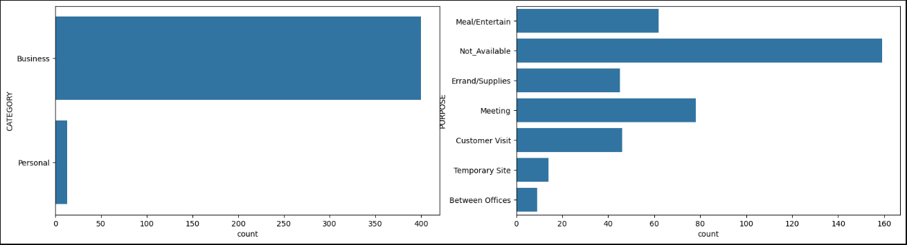
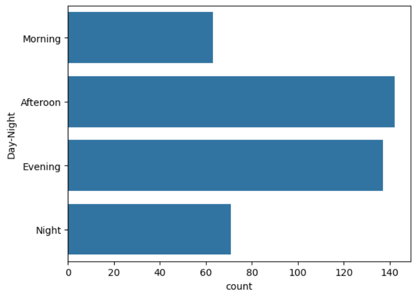

# 🚖 Uber Data Analysis

## 📌 Overview

This project explores and analyzes Uber trip data to uncover usage patterns, trip purposes, and mileage trends. By examining ride details such as start and stop times, trip categories, and distances, we can better understand customer behavior and identify key business insights.

## 📊 Dataset Description

The dataset (`UberDataset.csv`) contains **1,156 Uber rides** with the following fields:

* **START_DATE, END_DATE** – Trip start and end timestamps
* **CATEGORY** – Business or personal classification
* **START, STOP** – Trip origin and destination
* **MILES** – Distance traveled
* **PURPOSE** – Trip reason (e.g., Meeting, Meal/Entertain, Customer Visit)

## 🎯 Objectives

* Identify peak ride times and dates
* Analyze trip purposes and their frequency
* Explore mileage trends (short vs. long trips)
* Understand popular start and stop locations

## 🛠️ Tools & Libraries

* **Python**
* **Pandas** – Data manipulation
* **Matplotlib & Seaborn** – Visualization
* **Jupyter Notebook** – Interactive analysis

## 🔍 Key Insights

# 1) In which category do people book the most Uber rides?

- for bussiness related work , people use uber the most

# 2) For which purpose do people book Uber rides the most?

-for meetings ubers are used the most



# 3) At what time do people book cabs the most from Uber?

- ubers are booked mostly In the Afternoon




# 4) On which days of the week do people book Uber rides the most?
- Friday is the most whereas on Sunday least amount of Uber rides are booked


* Most trips were taken for **business purposes**, especially meetings and customer visits.
* **Peak travel times** were during **working hours (8 AM – 6 PM)**, reflecting professional usage.
* Significant mileage spikes occurred during **long-distance trips** between cities.
* A majority of rides started and ended within the same city, indicating **short-distance, local travel**.

## 🚀 How to Run the Project

1. Clone this repository:

   ```bash
   git clone https://github.com/your-username/Uber-Data-Analysis.git
   ```
2. Navigate to the project folder:

   ```bash
   cd Uber-Data-Analysis
   ```
3. Install the required libraries:

   ```bash
   pip install pandas matplotlib seaborn jupyter
   ```
4. Open and run the notebook:

   ```bash
   jupyter notebook "Uber Data Analysis.ipynb"
   ```

## 📈 Results & Visualizations

The notebook provides:

* Bar charts of trip purposes
* Time series of daily and monthly ride counts
* Mileage distribution plots
* Heatmaps of start vs. stop locations

## 🔮 Future Improvements

* Expand the dataset with more years of rides for trend validation
* Incorporate external factors (e.g., weather, events) for deeper insights
* Automate the analysis pipeline for real-time reporting

## ✅ Conclusion

This analysis highlights **business-driven travel behavior** within Uber usage, with clear peaks in working hours, meeting-related purposes, and frequent local trips. Such insights can help optimize ride planning, improve business travel policies, and guide strategic decision-making.


